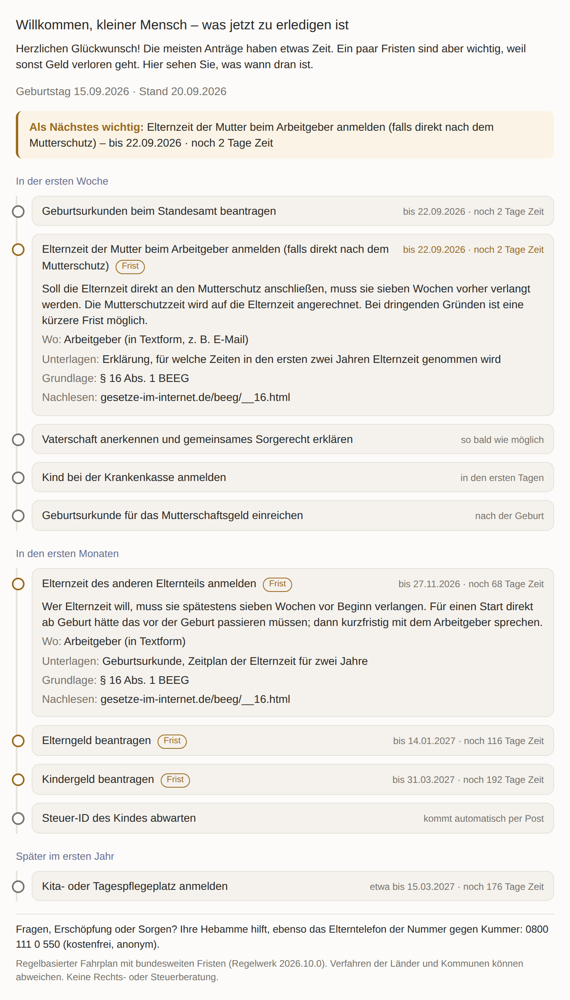
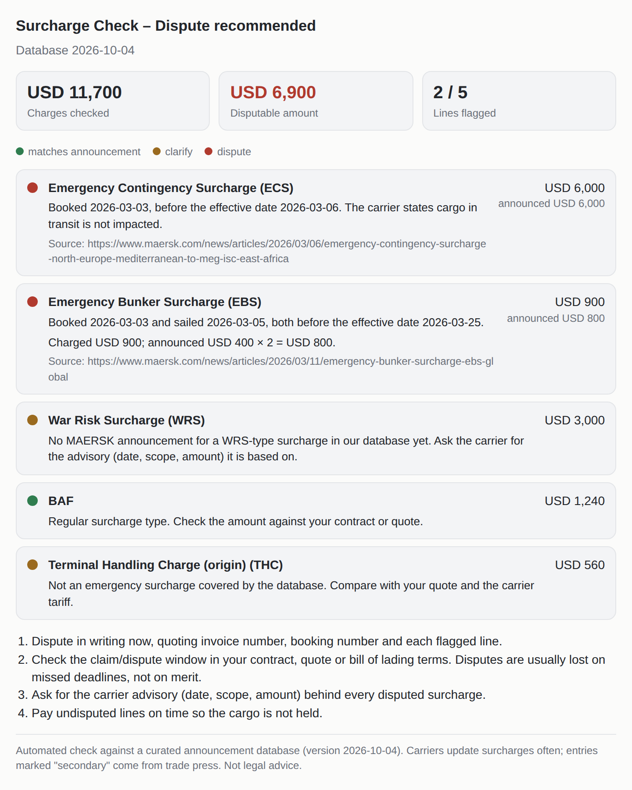
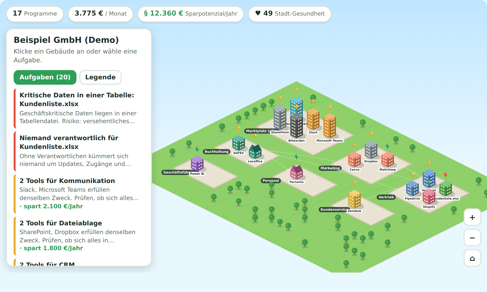

# PluginPilot: ChatGPT plugins (Surcharge Check, Trauerfall-Lotse, Geburts-Lotse)

[](https://render.com/deploy?repo=https://github.com/jdub004/pluginpilot)

A ChatGPT plugin (remote MCP server + visual timeline) for bereaved people in Germany: **"Someone has died, what do I have to do now?"**
It returns a personal, dated plan with the next critical deadline, responsible office, documents and legal basis.


**Geburts-Lotse** (`/geburt/mcp`, tool `plan_after_birth`): birth registration, Elternzeit notice (§ 16 BEEG), Elterngeld (§ 7 BEEG, 3 months retroactive), Kindergeld (§ 70 EStG, 6 months), Unterhaltsvorschuss (§ 4 UVG, 1 month), paternity, Kita. Support line: Elterntelefon 0800 111 0 550.



**Surcharge Check** (`/surcharge/mcp`, tool `check_freight_surcharges`, English): audits ocean freight surcharges from the 2026 Hormuz crisis (war risk, emergency conflict/contingency, emergency bunker, operational cost recovery) against a sourced carrier-announcement database: scope, amount, effective date, cargo-in-transit rule, later dates for US FMC-regulated trades, duplicates, all-in conflicts. It returns the disputable amount and a dispute letter.



**Software-Stadt** (`/city/mcp`, tool `map_software_city`): a company's software landscape as a Sims-style town. Departments become districts, programs become buildings (height = users), data flows become paths. It finds quests: overlapping tools, unused licences (with savings), critical spreadsheets, missing owners, shadow IT and data islands.



Endpoints: `/mcp` (Trauerfall, also `/trauerfall/mcp`), `/geburt/mcp` `/surcharge/mcp` and `/city/mcp`, which are separate plugins on one server with a shared deadline core and widget.

Why this product: [docs/DEMAND_ANALYSIS.md](docs/DEMAND_ANALYSIS.md) → [docs/BEHOERDEN_LOTSE_VARIANTS.md](docs/BEHOERDEN_LOTSE_VARIANTS.md).

```bash
npm ci
npm test                    # unit + MCP integration tests
npm run build && npm start  # POST /mcp, GET /health
npx tsx scripts/preview-widget.ts preview.html   # open the widget in a browser with an example case
```

- Tool: `plan_after_death` (read-only, no login, no personal data beyond a date and yes/no facts)
- Widget: `ui://trauerfall-lotse/timeline-v1.html` (MCP Apps, `text/html;profile=mcp-app`)
- Deadlines covered: Standesamt (3rd Werktag, § 28 PStG), Sterbevierteljahr (30 days), freiwillige Krankenversicherung (3 months, § 9 SGB V), Mietvertrag (1 month, §§ 563/564 BGB), Erbausschlagung (6 weeks / 6 months, § 1944 BGB), Erbschaftsteuer-Anzeige (3 months, § 30 ErbStG), Witwen-/Waisenrente (12 months, § 99 SGB VI), testament delivery (§ 2259 BGB), and more.

Not legal advice. Support line shown in every result: TelefonSeelsorge 0800 111 0 111.

`src/domain/nebenkosten/` is the archived first prototype (not registered in the server).
