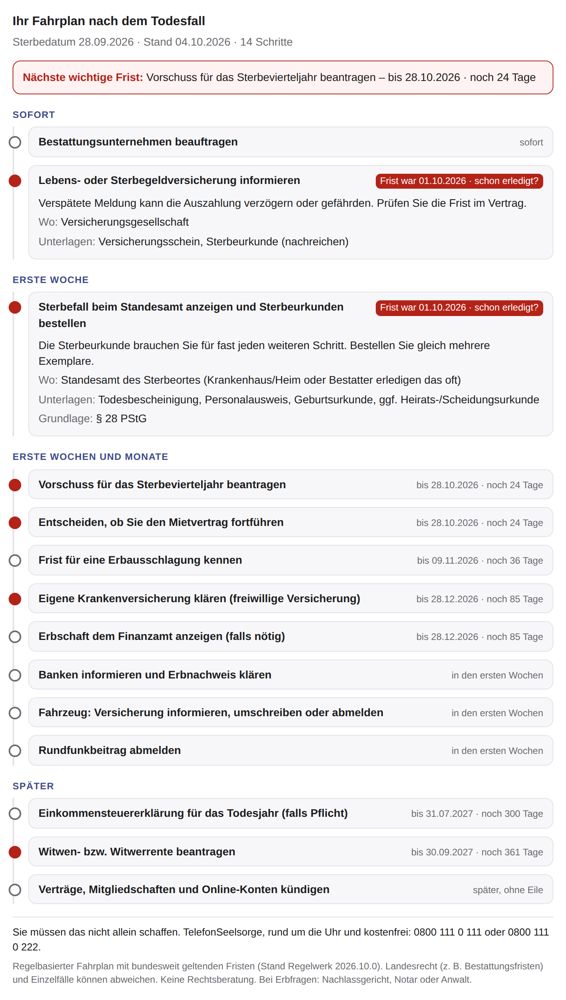

# PluginPilot: Trauerfall-Lotse

A ChatGPT plugin (remote MCP server + visual timeline) for bereaved people in Germany: **"Someone has died, what do I have to do now?"**
It returns a personal, dated plan with the next critical deadline, responsible office, documents and legal basis.



Why this product: [docs/DEMAND_ANALYSIS.md](docs/DEMAND_ANALYSIS.md) → [docs/BEHOERDEN_LOTSE_VARIANTS.md](docs/BEHOERDEN_LOTSE_VARIANTS.md).

```bash
npm ci
npm test                    # unit + MCP integration tests
npm run build && npm start  # POST /mcp, GET /health
npx tsx scripts/preview-widget.ts preview.html   # open the widget in a browser with an example case
```

- Tool: `plan_after_death` (read-only, no login, no personal data beyond a date and yes/no facts)
- Widget: `ui://trauerfall-lotse/timeline-v1.html` (MCP Apps, `text/html;profile=mcp-app`)
- Deadlines covered: Standesamt (3rd Werktag, § 28 PStG), Sterbevierteljahr (30 days), freiwillige Krankenversicherung (3 months, § 9 SGB V), Mietvertrag (1 month, §§ 563/564 BGB), Erbausschlagung (6 weeks / 6 months, § 1944 BGB), Erbschaftsteuer-Anzeige (3 months, § 30 ErbStG), Witwen-/Waisenrente (12 months, § 99 SGB VI), testament delivery (§ 2259 BGB), and more.

Not legal advice. Support line shown in every result: TelefonSeelsorge 0800 111 0 111.

`src/domain/nebenkosten/` is the archived first prototype (not registered in the server).
